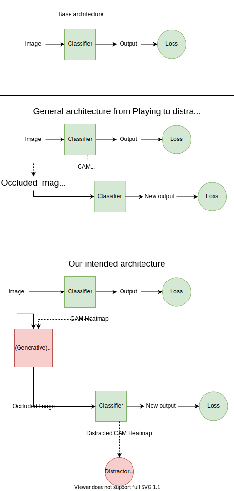

- [ ] come up with distractor loss functions 
- [ ] define interesting distractor internal architecture
- [x] write pseudocode
- [ ] pick initial dataset
- [ ] describe dataset
- [ ] implement pseudocode

## define distractor internal architecture(s)
### input parameters
- original image (optional)
- Grad-CAM heatmap


### output options
1. occlusion mask, to overlay onto original image
2.  directly occluded image
  - may require an intermediate loss? idk, might be quite complex

### layer structure options
1. dense 3 layer feedforward
2. Encoder decoder (conv)
- requires thought to be put into latent dimensions, and depth of encoder and decoder + decoder dimensions
3. ?

### overall structure/pipeline

<!--  -->


## pseudocode
```python
# basic training loop
for batch in dataset:
    outputs = classifier(batch)
    loss = L(outputs, batch_ground_truths)
    loss.backprop()

# heatmap collection & distractor training loop
while True:
    while not distractor.converged:
        for batch in dataset: # entire dataset? or only misclassified samples?
            outputs = classifier(batch)
            heatmaps = heatmaps(classifier, batch)
            occlusion_masks = distractor(batch, heatmaps)
            occluded_batch = occlude(batch, occlusion_masks)
            new_heatmaps = heatmaps(classifier, occluded_batch)

            distractor_loss = L_distractor(new_heatmaps, etc...)
            distractor_loss.backprop()

    while not classifier.converged:
        for batch in dataset: # entire dataset? or only misclassified samples?
            outputs = classifier(batch)
            heatmaps = heatmaps(classifier, batch)
            occlusion_masks = distractor(batch, heatmaps)
            occluded_batch = occlude(batch, occlusion_masks)
            new_outputs = classifier(occluded_batch)
            
            classifier_loss = L_classifier(new_outputs, occluded_batch_ground_truths)
            classifier_loss.backprop()
```